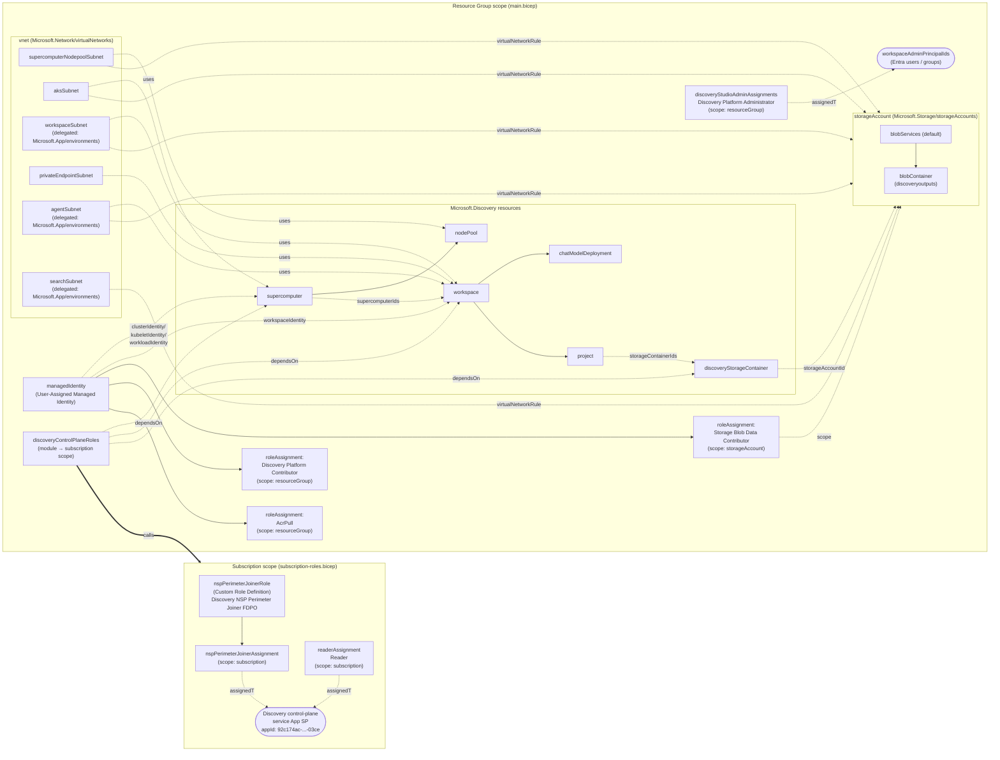

# Bicep テンプレート デプロイリソース一覧

このドキュメントは [main.bicep](main.bicep) および [subscription-roles.bicep](subscription-roles.bicep) によってデプロイされる Azure リソースの一覧と、それらの関連性を示します。

## リソース一覧

### リソースグループ スコープ (main.bicep)

| # | シンボリック名 | リソースタイプ | API バージョン | 主な用途 |
|---|---|---|---|---|
| 1 | `vnet` | `Microsoft.Network/virtualNetworks` | 2024-05-01 | 全リソースの基盤となる仮想ネットワーク。6 つのサブネットを含む。 |
| 2 | `managedIdentity` | `Microsoft.ManagedIdentity/userAssignedIdentities` | 2024-11-30 | Supercomputer / Workspace / ロール割り当てで使用する User-Assigned Managed Identity。 |
| 3 | `storageAccount` | `Microsoft.Storage/storageAccounts` | 2023-05-01 | Discovery の出力先ストレージアカウント (StorageV2 / 冗長性・アクセス層は `deploymentMode` のプリセット。CostOptimized: `Standard_LRS` + `Cool` / Production: `Standard_GRS` + `Hot`)。`networkAcls` は `defaultAction: Allow` + 5 サブネットの `virtualNetworkRules` を設定。 |
| 4 | `blobServices` | `Microsoft.Storage/storageAccounts/blobServices` | 2023-05-01 | Blob サービス既定構成 (CORS 設定含む)。`storageAccount` の子。 |
| 5 | `blobContainer` | `Microsoft.Storage/storageAccounts/blobServices/containers` | 2023-05-01 | Discovery 出力用 Blob コンテナー (`publicAccess: None`)。`blobServices` の子。 |
| 6 | `storageBlobDataContributorAssignment` | `Microsoft.Authorization/roleAssignments` | 2022-04-01 | `managedIdentity` に対する Storage Blob Data Contributor ロール割り当て (スコープ: storageAccount)。 |
| 7 | `discoveryPlatformContributorAssignment` | `Microsoft.Authorization/roleAssignments` | 2022-04-01 | `managedIdentity` に対する Discovery Platform Contributor ロール割り当て (スコープ: リソースグループ)。 |
| 8 | `acrPullAssignment` | `Microsoft.Authorization/roleAssignments` | 2022-04-01 | `managedIdentity` に対する AcrPull ロール割り当て (スコープ: リソースグループ)。 |
| 9 | `discoveryStudioAdminAssignments` | `Microsoft.Authorization/roleAssignments` | 2022-04-01 | `workspaceAdminPrincipalIds` に対する Discovery Platform Administrator ロール割り当て (スコープ: リソースグループ)。配列分ループ。Quickstart には無い独自拡張。 |
| 10 | `supercomputer` | `Microsoft.Discovery/supercomputers` | 2026-06-01 | Microsoft Discovery Supercomputer。`aksSubnet` を利用。内部 AKS のシステムノードプール SKU は `systemSku` で指定 (`deploymentMode` プリセット)。 |
| 11 | `nodePool` | `Microsoft.Discovery/supercomputers/nodePools` | 2026-06-01 | Supercomputer 配下の Node Pool。`supercomputerNodepoolSubnet` を利用。VM サイズ / 最大・最小ノード数 / 優先度 / OS ディスクサイズは `deploymentMode` プリセット (CostOptimized: 最大 1 台・Spot・64 GB / Production: 最大 3 台・Regular・120 GB)。いずれも最小ノード数 0 でゼロスケール。 |
| 12 | `workspace` | `Microsoft.Discovery/workspaces` | 2026-06-01 | Discovery Workspace。Supercomputer と 3 サブネット (workspace / agent / privateEndpoint) を参照。タグで `discovery.workbench.enableGhcpAiFeatures` / `discovery.workbench.enableExtensions` / `NetworkIsolation` を制御。 |
| 13 | `chatModelDeployment` | `Microsoft.Discovery/workspaces/chatModelDeployments` | 2026-06-01 | Workspace 配下のチャットモデルデプロイ (OpenAI 形式 / 既定 `gpt-5.4`)。 |
| 14 | `discoveryStorageContainer` | `Microsoft.Discovery/storageContainers` | 2026-06-01 | Discovery のストレージコンテナー。`storageAccount` を Blob ストアとして参照。 |
| 15 | `project` | `Microsoft.Discovery/workspaces/projects` | 2026-06-01 | Workspace 配下の Project。`discoveryStorageContainer` を参照。 |
| 16 | `discoveryControlPlaneRoles` | `Microsoft.Resources/deployments` (module) | — | サブスクリプション スコープ モジュール呼び出し。[subscription-roles.bicep](subscription-roles.bicep) を実行。Quickstart には無い独自拡張。 |

### サブスクリプション スコープ (subscription-roles.bicep)

Discovery の第1パーティ サービスプリンシパル (Discovery control-plane service App, App ID: `92c174ac-8e41-4815-a1b7-d81b19ab03ce`) が Network Security Perimeter (NSP) を構成できるようにする RBAC。これがないと Workspace / Supercomputer / Bookshelf 作成時に自動生成される `networkSecurityPerimeter` が `InternalServerError` で失敗します。

| # | シンボリック名 | リソースタイプ | API バージョン | 主な用途 |
|---|---|---|---|---|
| S1 | `nspPerimeterJoinerRole` | `Microsoft.Authorization/roleDefinitions` | 2022-04-01 | カスタムロール「Discovery NSP Perimeter Joiner FDPO」。アクション: `joinPerimeterRule/action` + `networkSecurityPerimeterOperationStatuses/read`。 |
| S2 | `nspPerimeterJoinerAssignment` | `Microsoft.Authorization/roleAssignments` | 2022-04-01 | 上記カスタムロールを Discovery 第1パーティ SP に割り当て (スコープ: サブスクリプション)。 |
| S3 | `readerAssignment` | `Microsoft.Authorization/roleAssignments` | 2022-04-01 | 組み込み Reader ロール (`acdd72a7-3385-48ef-bd42-f606fba81ae7`) を Discovery 第1パーティ SP に割り当て (スコープ: サブスクリプション)。 |

### VNet に含まれるサブネット

| サブネット名 | アドレスプレフィックス (既定) | 委任 | サービスエンドポイント | 主な利用者 |
|---|---|---|---|---|
| `supercomputerNodepoolSubnet` | 10.0.1.0/24 | なし | `Microsoft.Storage` | `nodePool` |
| `aksSubnet` | 10.0.2.0/24 | なし | `Microsoft.Storage` | `supercomputer` |
| `workspaceSubnet` | 10.0.3.0/24 | `Microsoft.App/environments` | `Microsoft.Storage` | `workspace` |
| `privateEndpointSubnet` | 10.0.4.0/24 | なし | なし | `workspace` (Private Endpoint) |
| `agentSubnet` | 10.0.5.0/24 | `Microsoft.App/environments` | `Microsoft.Storage` | `workspace` (Agent) |
| `searchSubnet` | 10.0.6.0/24 | `Microsoft.App/environments` | `Microsoft.Storage` | (予約: Search 用) |

### コストモード (`deploymentMode`) とタグ

`deploymentMode` (`CostOptimized` 既定 / `Production`) がコスト関連パラメーターを一括で切り替えます。対象は ノードプール (VM サイズ / 最大・最小ノード数 / 優先度 / OS ディスク)、スパコンのシステムノードプール SKU、ストレージの冗長性とアクセス層です。個別パラメーターを明示指定した場合はそちらが優先されます。詳細は [README 1-1](README.md#1-1-コストモードdeploymentmode) を参照。

タグを持てるすべてのリソース (VNet / UAMI / ストレージアカウント / Discovery 各リソース) には `SecurityControl: Ignore` が付与されます。ロール割り当てと Blob サービス / コンテナーは ARM 上タグを持てないため対象外です。

`CostOptimized` の場合、Discovery が自動生成するマネージドリソースグループ (`mrg-dwsp-*` / `mrg-dscmp-*`) 内の AKS / Container Apps / Cosmos DB / Log Analytics / ストレージについては、Bicep では制御できないためデプロイ後に `optimize-mrg.sh` (`optimize-mrg.ps1`) がベストエフォートで設定変更します。変更項目の一覧は [README 1-1](README.md#1-1-コストモードdeploymentmode) の表を参照。

## リソース関連図 (Mermaid)

## 依存関係のまとめ

- **ネットワーク基盤**: `vnet` が最初に作られ、すべての Discovery リソース (`supercomputer` / `nodePool` / `workspace`) が明示的に `dependsOn: [vnet]` を宣言。
- **ID 基盤**: `managedIdentity` は Supercomputer の cluster/kubelet/workload identity と Workspace の workspaceIdentity として参照され、リソースグループ内の 3 つのロール割り当ての `principalId` になる。
- **ストレージ**: `storageAccount` → `blobServices` → `blobContainer` の親子関係。`storageAccount` は `dependsOn: [vnet]` を宣言し、`networkAcls.virtualNetworkRules` で 5 サブネット (privateEndpointSubnet を除く) を許可する。`defaultAction` は `Allow` のまま (Discovery コントロールプレーンが Storage の信頼されたサービス一覧に未対応のため)。`discoveryStorageContainer` が `storageAccount.id` を参照し、`project` は `discoveryStorageContainer.id` を参照する。
- **UAMI ロール割り当て (リソースグループ内)**: Storage Blob Data Contributor は `storageAccount` スコープ、Discovery Platform Contributor と AcrPull はリソースグループスコープ。
- **Discovery Studio 管理者ロール (リソースグループ内 / 独自拡張)**: `workspaceAdminPrincipalIds` に渡した Entra Object ID へ Discovery Platform Administrator をリソースグループスコープで付与。これがないと Discovery Studio 上で「Access denied」となり Agent / Project が作成できない。
- **Discovery スタック**: `supercomputer` → `nodePool` (親子)、`workspace` → `chatModelDeployment` / `project` (親子)、`workspace` は `supercomputer.id` を参照し、`project` は `chatModelDeployment` に `dependsOn`。
- **Discovery 第1パーティ SP へのロール割り当て (サブスクリプション スコープ)**: `discoveryControlPlaneRoles` モジュールが Discovery control-plane service App にカスタムロール「Discovery NSP Perimeter Joiner FDPO」と組み込み Reader をサブスクリプション スコープで付与。`supercomputer` / `workspace` / `discoveryStorageContainer` はこのモジュールに `dependsOn` し、Discovery コントロールプレーンが NSP を構成する前に必要な権限が伝播することを保証する。
- **必要なデプロイ権限**: 上記モジュールはサブスクリプション スコープでカスタムロール作成 + ロール割り当てを行うため、デプロイ実行者は **Subscription 上の Owner または User Access Administrator** 権限を持つ必要がある。第1パーティ SP がテナントに存在しない場合、`deploy.ps1` が `az ad sp create` で作成するため **Application Administrator** (Entra ID) も要求される場合がある。

## 参考ドキュメント

- [Quickstart: Deploy Microsoft Discovery infrastructure using Azure portal § 1.b Assign required roles to Discovery control plane service app](https://learn.microsoft.com/en-us/azure/microsoft-discovery/quickstart-infrastructure-portal#b-assign-required-roles-to-discovery-control-plane-service-app)
- [Configure network security for Microsoft Discovery workspaces § Assign the NSP Perimeter Joiner role](https://learn.microsoft.com/en-us/azure/microsoft-discovery/how-to-configure-network-security?tabs=azure-cli#assign-the-nsp-perimeter-joiner-role)
